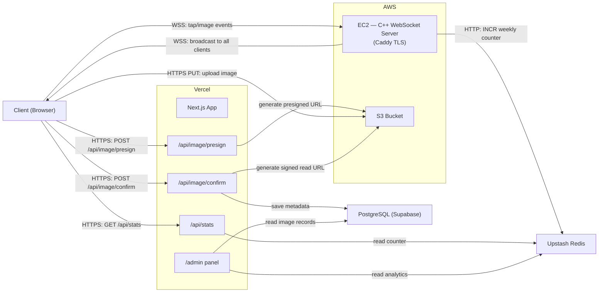

# Pookie-Press

A real-time love-tap app for couples. Tap a heart button to send love to your partner — they see floating hearts animate on their screen in real time. A shared weekly progress meter tracks how many taps you've exchanged together.

## Features

- **Heart button** with pulsing animation and haptic feel
- **Floating hearts** that animate across the screen on each tap
- **Love meter** — shared weekly progress bar toward a configurable goal
- **Real-time sync** — your partner sees hearts the moment you tap
- **Optimistic UI** — instant feedback with debounced server sync

## Tech Stack

| Layer | Technology |
|---|---|
| **Framework** | Next.js 16 (App Router, React 19) |
| **Language** | TypeScript 5 |
| **Styling** | Tailwind CSS 4 (forced dark mode) |
| **Animation** | Framer Motion |
| **Database** | PostgreSQL (Supabase or Neon) |
| **ORM** | Prisma 7 (driver adapter pattern) |
| **Cache** | Upstash Redis (HTTP-based) |
| **Real-time** | Custom C++ WebSocket server ([repo + benchmarks](https://github.com/dmytroMai20/pookie-press-ws)) |
| **Deployment** | Vercel (app) + AWS EC2 (WebSocket server) |

## Architecture

Hexagonal architecture (ports & adapters) — business logic is decoupled from infrastructure.

```
src/
├── domain/       Pure business logic (models, services)
├── ports/        TypeScript interfaces defining contracts
├── adapters/     Concrete implementations (Prisma, Redis, WebSocket)
├── app/          Next.js App Router (UI + API routes)
└── lib/          DI container, config, utilities
```

See `docs/architecture.md` for the full architecture overview.

## Cloud Architecture



## Design Decisions

### Why a custom C++ WebSocket server over Pusher?

The MVP used Pusher Channels for real-time delivery. While Pusher works well with serverless, it adds per-message costs and a third-party dependency. The custom C++ WebSocket server runs on a single EC2 instance with Caddy for TLS termination, uses MessagePack binary serialization, and handles all client-to-client fan-out directly — no round-trip through the Next.js server needed. This gives full control over the transport layer, lower latency, and zero per-message costs. See the [WebSocket server repo](https://github.com/dmytroMai20/pookie-press-ws) for implementation details and benchmarks.

### Why Prisma 7 driver adapters?

Prisma 7 removed `url` from the `datasource` block in `schema.prisma`. The connection URL is now configured via `prisma.config.ts` (for CLI operations) and passed at runtime through a driver adapter (`@prisma/adapter-pg`). This gives more control over connection management and is the forward-compatible pattern.

### Why Upstash Redis over direct PostgreSQL queries for counts?

Redis `INCR` is atomic and returns the new value in a single operation — perfect for a fast tap counter. The weekly count is stored in Redis and used as the source of truth for display. Currently, tap events flow directly through the WebSocket server and only update Redis counters — individual tap records are not persisted to PostgreSQL. This keeps the hot path fast and avoids database write overhead on every tap.

### Why optimistic updates with debounced flush?

Rapid tapping needs to feel instant. The UI increments the meter immediately on each tap, queues taps locally, and flushes them to the WebSocket server in a batch. The C++ server broadcasts to all connected clients directly, so partners see hearts in real time with minimal latency.

### Why hexagonal architecture for an MVP?

The ports & adapters pattern makes it trivial to swap infrastructure. For example, migrating from Pusher to the custom C++ WebSocket server only required a new adapter — no domain or API changes. This keeps the MVP lean while being extensible for post-MVP features (auth, multi-couple support, analytics).

## Getting Started

### Prerequisites

- Node.js 20+
- pnpm
- A PostgreSQL database (Supabase or Neon)
- An Upstash Redis database
- A running instance of the [C++ WebSocket server](https://github.com/dmytroMai20/pookie-press-ws)

### Setup

```bash
# Install dependencies
pnpm install

# Copy environment variables
cp .env.example .env
# Fill in your credentials in .env

# Generate Prisma client
pnpm db:generate

# Push schema to database
pnpm db:push

# Start dev server
pnpm dev
```

Open [http://localhost:3000](http://localhost:3000) — open in two tabs to test real-time sync.

### Environment Variables

| Variable | Description |
|---|---|
| `DATABASE_URL` | PostgreSQL connection string |
| `UPSTASH_REDIS_REST_URL` | Upstash Redis REST endpoint |
| `UPSTASH_REDIS_REST_TOKEN` | Upstash Redis auth token |
| `NEXT_PUBLIC_WS_URL` | WebSocket server URL (e.g. `wss://ws.yourdomain.com`) |
| `WEEKLY_TAP_GOAL` | Weekly goal target (default: 50) |
| `ADMIN_PASSWORD` | Admin panel password (min 16 chars) |
| `JWT_SECRET` | JWT signing secret (min 32 chars) |
| `AWS_ACCESS_KEY_ID` | AWS IAM access key (for S3 image uploads) |
| `AWS_SECRET_ACCESS_KEY` | AWS IAM secret key |
| `AWS_REGION` | S3 bucket region |
| `AWS_S3_BUCKET` | S3 bucket name |
| `IMAGE_DISPLAY_SECONDS` | Image overlay duration (default: 5) |
| `IMAGE_MAX_SIZE_MB` | Max upload size in MB (default: 4.5) |

## Scripts

| Command | Description |
|---|---|
| `pnpm dev` | Start development server |
| `pnpm build` | Production build |
| `pnpm start` | Start production server |
| `pnpm test` | Run tests in watch mode |
| `pnpm test:run` | Run tests once |
| `pnpm db:generate` | Generate Prisma client |
| `pnpm db:migrate` | Run database migrations |
| `pnpm db:push` | Push schema to database |

## Testing

```bash
pnpm test:run
```

20 unit tests covering domain models, services, and adapters. Tests use Vitest with mocked infrastructure.

## Deploy to Vercel

1. Push to GitHub
2. Connect repo to Vercel
3. Add environment variables in Vercel dashboard
4. Deploy — Vercel auto-detects Next.js
5. Run `pnpm db:push` against production database

Vercel integrations for [Neon](https://vercel.com/integrations/neon) and [Upstash](https://vercel.com/integrations/upstash) can auto-provision database credentials.

## Documentation

- `docs/architecture.md` — Architecture overview and data flow
- `docs/database.md` — Database schema, commands, and seeding
- `docs/websockets.md` — Real-time integration details
- `docs/deployment.md` — Deployment guide
